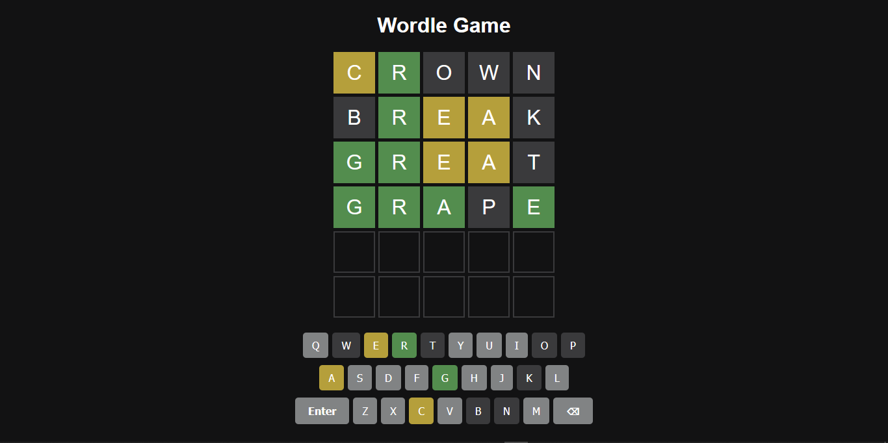

# 🎯 Wordle Game

A responsive web-based Wordle clone built using HTML, CSS, and JavaScript.

## Features

- 🔠 5-letter word guessing
- 🎯 6 attempts to solve the puzzle
- ⌨️ On-screen & physical keyboard support
- 🌈 Color-coded feedback for::
    - **🟩 Green**: Correct letter, correct position
    - **🟨 Yellow**: Correct letter, wrong position.
    - **⬛ Gray**: Letter not in the word.

- 🔄 Restart modal on game end
- 🧩 Dictionary API for word validation
- 💡 Animations: Flip, bounce, shake

# 📷 Demo


# 🛠️ Getting Started

1. **Clone the repository:**

     ```bash
     git clone https://github.com/bijuaryal91/wordle.git
     ```
2. **Open `index.html` in your browser.**


# 📁 Project Structure
   ```bash
  wordle/
├── index.html
├── style.css
├── main.js
└── image.png
   ```

# 📚 Resources
- [Dictionary API](https://dictionaryapi.dev/)
- [CSS Animation Guide](https://developer.mozilla.org/en-US/docs/Web/CSS/CSS_Animations)

# 🧪 Live Preview
- [Live Preview](https://bijuaryal91.github.io/wordle)

# 🤝 Contributing
Pull requests are welcome. For major changes, please open an issue first to discuss what you would like to change.